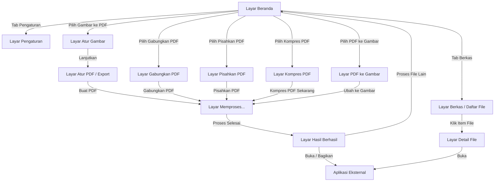

# DESIGN.md - Spesifikasi Desain App Native SakuPDF

Dokumen ini berisi spesifikasi desain lengkap untuk aplikasi native Android **SakuPDF**, yang disarikan dan dianalisis langsung dari proyek Stitch (`projects/13535335703337253515`) serta arsip referensi desain lokal (`Design/sakupdf_design.zip`).

---

## 1. Ringkasan Proyek & Konfigurasi Utama

- **Nama Aplikasi**: SakuPDF
- **Application ID / Package**: `com.sakupdf.app`
- **Target Platform**: Native Android (Kotlin + Jetpack Compose + Material 3)
- **Minimum SDK**: 26 (Android 8.0 Oreo)
- **Compile SDK**: 36
- **Target SDK**: 36
- **Bahasa UI**: Bahasa Indonesia (Semua teks visual)
- **Arsitektur & Pendekatan**:
  - Material 3 Design System (`androidx.compose.material3`)
  - Pemrosesan dokumen privat & offline di perangkat pengguna
  - Tonal Layer Elevation (Mengurangi drop shadow tebal, menggunakan gradasi warna tonal M3 dan pembatas border stroke subtle)

---

## 2. Design Tokens & Design System (SakuPDF Narrative System)

### 2.1 Skema Warna (Color Tokens & Material 3 Mapping)

Warna utama berpusat pada nuansa **Emerald/Teal** (#00897B / #00685D) yang melambangkan keamanan, privasi, dan profesionalitas, dipadukan dengan aksen merah khas dokumen PDF.

| Token Material 3 | Kode Hex | Penggunaan dalam Jetpack Compose |
| :--- | :--- | :--- |
| `primary` | `#00685D` / `#00897B` | Warna utama tombol aksi (FAB, Primary Button), header aktif, tab seleksi |
| `onPrimary` | `#FFFFFF` | Teks dan ikon di atas permukaan warna `primary` |
| `primaryContainer` | `#E0F2F1` / `#008376` | Latar belakang chip terpilih, container aktif, badge mint pale |
| `onPrimaryContainer` | `#00201C` / `#F4FFFB` | Teks & ikon di atas `primaryContainer` |
| `secondary` | `#516161` | Warna elemen sekunder, teks penjelasan minor, ikon netral |
| `secondaryContainer` | `#D4E6E5` | Container pembantu, filter chip pasif |
| `onSecondaryContainer` | `#576867` | Teks & ikon di atas `secondaryContainer` |
| `tertiary` (PDF Accent) | `#B7131A` / `#E53935` | Aksen khusus dokumen PDF, lencana status PDF, tombol hapus/destruktif |
| `tertiaryContainer` | `#DB322F` | Latar belakang container aksen merah |
| `background` | `#F8F9FA` | Latar belakang utama seluruh layar aplikasi (Soft Off-White) |
| `surface` | `#F8F9FA` | Permukaan dasar komponen |
| `surfaceContainerLowest` | `#FFFFFF` | Latar belakang kartu dokumen, item daftar, modal dialog (Pure White) |
| `surfaceContainer` | `#EDEEEF` | Pembatas container dan background bidang input |
| `onSurface` | `#191C1D` | Warna teks utama (Dark Navy / Near-Black high contrast) |
| `onSurfaceVariant` | `#3D4946` | Warna teks deskripsi & metadata sekunder |
| `outline` | `#6D7A77` | Garis tepi input field & outlined button |
| `outlineVariant` | `#BCC9C5` | Garis pemisah Subtle Divider (1dp) |
| `error` | `#BA1A1A` | Status kesalahan / peringatan bahaya |
| `errorContainer` | `#FFDAD6` | Container latar belakang error |

---

### 2.2 Tipografi (Typography Scale)

Sistem menggunakan font **Inter** (atau `FontFamily.Default` Roboto pada Android dengan penyesuaian bobot & ukuran M3):

| Token Tipografi | Font | Ukuran | Line Height | Weight | Penggunaan UI |
| :--- | :--- | :--- | :--- | :--- | :--- |
| `Display Large` | Inter | 57 sp | 64 sp | Normal (400) | Judul hero / statistik besar |
| `Headline Large` | Inter | 32 sp | 40 sp | Normal (400) | Judul utama layar (misal: "SakuPDF", "Kelola PDF") |
| `Headline Mobile` | Inter | 28 sp | 36 sp | Normal (400) | Judul layar pada ponsel |
| `Title Large` | Inter | 22 sp | 28 sp | Medium (500) | Judul Top App Bar, judul section ("Alat PDF", "Detail File") |
| `Title Medium` | Inter | 16 sp | 24 sp | Medium (500) | Judul kartu dokumen, nama file |
| `Body Large` | Inter | 16 sp | 24 sp | Normal (400) | Teks isi utama, paragraf deskripsi |
| `Body Medium` | Inter | 14 sp | 20 sp | Normal (400) | Sub-deskripsi, instruksi langkah, metadata file |
| `Label Large` | Inter | 14 sp | 20 sp | Medium (500) | Teks pada tombol, tab, filter chip |
| `Label Small` | Inter | 11 sp | 16 sp | Medium (500) | Lencana badge, ukuran file, tanggal, counter halaman |

---

### 2.3 Ukuran Grid, Spacing & Corner Radius

- **Grid Base Unit**: `8.dp`
- **Margin Outer (Mobile)**: `16.dp`
- **Margin Outer (Tablet)**: `24.dp`
- **Gutter / Jarak antar komponen**: `16.dp` (atau `8.dp` untuk item padat)
- **Minimum Touch Target**: `48.dp` x `48.dp` (untuk semua ikon & tombol interaktif)
- **Bentuk (Corner Radius)**:
  - Kartu Dokumen & Card Container: `16.dp` (`RoundedCornerShape(16.dp)`)
  - Bottom Sheet & Dialog Modal: `20.dp` (`RoundedCornerShape(topStart = 20.dp, topEnd = 20.dp)`)
  - Input Text Field (Outlined): `8.dp` (`RoundedCornerShape(8.dp)`)
  - Tombol Utama / Floating Action Button (FAB): Full Rounded / Pill (`CircleShape` atau `CornerSize(50%)`)

---

## 3. Komponen UI Utama (Jetpack Compose Component Specs)

### 3.1 Top App Bar
- **Gaya**: Material 3 `TopAppBar` / `CenterAlignedTopAppBar`.
- **Latar Belakang**: `MaterialTheme.colorScheme.background` (`#F8F9FA`). Saat konten di-scroll, memberikan elevasi tonal `primaryContainer` subtle (`#E0F2F1`).
- **Elemen Navigasi**: NavIcon `arrow_back` di sebelah kiri untuk layar child.
- **Elemen Aksi**: Action Icon di kanan (`more_vert`, `search`, `sort`, `info`).

### 3.2 Bottom Navigation Bar
- **Komponen M3**: `NavigationBar` & `NavigationBarItem`.
- **Tiga Destinasi Utama**:
  1. **Beranda** (Ikon: `home`)
  2. **Berkas** (Ikon: `description`)
  3. **Pengaturan** (Ikon: `settings`)
- **Indikator Aktif**: Indicator pill dengan warna `primaryContainer` (`#E0F2F1`) dan warna ikon `primary` (`#00685D`).

### 3.3 Kartu Dokumen (Document Card Component)
- **Container**: `Card` atau `Surface` dengan latar belakang `#FFFFFF` (`surfaceContainerLowest`), corner radius `16.dp`, dan border subtle `1.dp` (`#BCC9C5`).
- **Struktur Konten**:
  - Ikon Jenis Berkas di sebelah kiri (`picture_as_pdf` / `image` / `description`) dalam lingkaran container mint/teal.
  - Nama File (Judul: `Title Medium`, single line / max 2 line ellipsis).
  - Metadata (Subtitle: `Label Small`, misal: "2.4 MB • 12 Okt 2023").
  - Tombol Aksi Kanan: `IconButton` (`more_vert`).

### 3.4 Grid Alat PDF (Feature Tool Grid)
- **Layout**: Grid 2 kolom atau daftar item dengan sudut membulat `16.dp`.
- **Setiap Kartu Alat**:
  - Ikon fitur dalam kontainer melingkar berwarna mint (`#E0F2F1` / `#00897B`).
  - Judul Fitur (contoh: "Gambar ke PDF", "Gabungkan PDF").
  - Deskripsi Singkat (contoh: "Gabungkan beberapa gambar menjadi satu PDF").

### 3.5 Control & Form Elements
- **Segmented Button / Filter Chips**:
  - Chip Terpilih: Container `#E0F2F1` (`primaryContainer`), Teks & Checkmark `#00685D`.
  - Chip Tidak Terpilih: Surface putih `#FFFFFF`, Border `#BCC9C5`.
- **Radio Options Group**:
  - Menggunakan `RadioButton` M3 dengan teks label dan deskripsi bantuan di bawahnya.
- **Text Input Field**:
  - `OutlinedTextField` M3 dengan corner radius `8.dp`, label mengambang dalam Bahasa Indonesia.

### 3.6 Item Pemilihan Halaman / Grid Pratinjau (Page Selector Component)
- **Layout**: `LazyVerticalGrid` 2 hingga 3 kolom.
- **Kartu Halaman**: Pratinjau gambar/thumbnail halaman PDF dengan nomor halaman di sudut bawah.
- **Indikator Seleksi**: Lencana Checkmark (`check_circle`) di sudut kanan atas saat halaman dipilih, dengan garis pinggir (border) tebal berwarna `primary` (`#00685D`).

### 3.7 Progres & Loading State
- **Komponen**: `CircularProgressIndicator` atau `LinearProgressIndicator` melingkar dengan ikon dokumen di tengah.
- **Teks Status**: Menampilkan persentase (misal: "65%") dan detail progres (misal: "Memproses halaman 8 dari 12").
- **Banner Peringatan**: Box informasi (`#E0F2F1`) dengan ikon `info` ("Jangan tutup aplikasi selama proses berlangsung.").
- **Aksi Batal**: Tombol Outlined "Batalkan".

---

## 4. Analisis Detail 12 Layar Stitch

Berikut adalah rincian spesifikasi untuk seluruh 12 layar yang diinspeksi dari Stitch MCP & arsip `sakupdf_design.zip`:

---

### Layar 1: Beranda (Home Screen)
- **ID Stitch**: `projects/13535335703337253515/screens/284c1f7f685543b4b3eeb2264a0d89c5`
- **Header & Branding**:
  - Judul: `SakuPDF`
  - Badge Lencana Keamanan: `shield_lock` + "Privat & offline"
  - Judul Tagline: "Kelola PDF dengan mudah"
  - Deskripsi: "Cepat, praktis, dan diproses langsung di perangkat"
- **Bagian "Alat PDF" (Grid 5 Alat)**:
  1. `Gambar ke PDF` (`imagesmode`): "Gabungkan beberapa gambar menjadi satu PDF"
  2. `Gabungkan PDF` (`call_merge`): "Satukan beberapa file PDF"
  3. `Pisahkan PDF` (`call_split`): "Pisahkan halaman PDF"
  4. `Kompres PDF` (`compress`): "Kurangi ukuran file PDF"
  5. `PDF ke Gambar` (`picture_as_pdf`): "Ubah halaman PDF menjadi JPG atau PNG"
- **Bagian "File terbaru"**:
  - Header section dengan tombol aksi "Lihat semua".
  - Daftar 3 file sampel: `KTP_Scan.pdf` (245 KB • Hari ini), `Invoice_Agustus_2023.pdf` (1.2 MB • Kemarin), `Kontrak_Kerja_Draft_Final.pdf` (850 KB • 12 Agt).
- **FAB**: Floating Action Button `+` (`add`) di kanan bawah.
- **Navigasi Bawah**: Tab `Beranda` aktif.

---

### Layar 2: Berkas / Daftar File (File List Screen)
- **ID Stitch**: `projects/13535335703337253515/screens/2e39e76220274466b64f5c528075825b`
- **Top App Bar**:
  - Judul: "Berkas"
  - Ikon Aksi: `search` (Pencarian), `sort` (Pengurutan file)
- **Filter Chips Horizontal**:
  - `Semua` (Aktif / Selected)
  - `PDF`
  - `Gambar`
- **Daftar File**:
  - `Laporan_Tahunan_2023.pdf` (2.4 MB • 12 Okt 2023)
  - `KTP_Scan_Depan.jpg` (845 KB • 10 Okt 2023)
  - `Kontrak_Kerja_Sewa.pdf` (1.1 MB • 05 Okt 2023)
  - `Invoice_Desain_UI.pdf` (450 KB • 01 Okt 2023)
- **Navigasi Bawah**: Tab `Berkas` aktif.

---

### Layar 3: Detail File (File Details Screen)
- **ID Stitch**: `projects/13535335703337253515/screens/c2752dc069e44cb0aa8aad734e347bc6`
- **Top Bar**: `arrow_back`, Judul: "Detail File", Aksi: `more_vert`.
- **Area Pratinjau**:
  - Kartu thumbnail besar dengan overlay ikon mata `visibility`.
  - Nama File: `Laporan_Keuangan_Q3_2023_Final_Rev2.pdf`
  - Subtitle: "Dokumen dipindai dan diamankan"
- **Grid Metadata Dokumen**:
  - Jenis: `description` -> PDF
  - Ukuran: `sd_card` -> 2.4 MB
  - Halaman: `auto_stories` -> 12
  - Tanggal Dibuat: `calendar_today` -> 12 Okt 2023
  - Lokasi: `folder` -> `/storage/emulated/0/Documents/SakuPDF`
- **Bar Aksi Cepat (4 Tombol Bawah)**:
  - `Buka` (`open_in_new`)
  - `Bagikan` (`share`)
  - `Ubah nama` (`edit_document`)
  - `Hapus` (`delete` - warna merah/destruktif)

---

### Layar 4: Atur Gambar / Gambar ke PDF (Reorder Images Screen)
- **ID Stitch**: `projects/13535335703337253515/screens/a8b54e71cc804eaaadc6c872343d6bd5`
- **Top Bar**: `arrow_back`, Judul: "Gambar ke PDF", Tombol Aksi: `+ Tambah` (`add_photo_alternate`).
- **Sub-Header Banner**:
  - Counter: "4 gambar dipilih"
  - Petunjuk: "Tekan dan tahan untuk mengubah urutan"
- **Daftar/Grid Gambar Interaktif**:
  - Setiap item gambar dilengkapi pegangan seret (`drag_indicator`), tombol putar gambar (`rotate_right`), dan tombol hapus (`delete`).
- **Bottom Bar**:
  - Outlined Button: `+ Tambah gambar` (`add_photo_alternate`)
  - Primary Button: `Lanjutkan` (Tombol pill penuh)

---

### Layar 5: Atur PDF / Pengaturan Export (PDF Export Settings Screen)
- **ID Stitch**: `projects/13535335703337253515/screens/91ad4f2d3f2c4896ba4eeb8fb6b84466`
- **Top Bar**: `arrow_back`, Judul: "Atur PDF", Aksi: `more_vert`.
- **Ringkasan**: "4 Gambar Dipilih • Siap digabungkan menjadi PDF."
- **Formulir Pengaturan**:
  1. **Nama File**: `OutlinedTextField` (Default prefill: `SakuPDF_2026-08-05`)
  2. **Ukuran Halaman**: Segmented Chips (`Otomatis` [Dipilih], `A4`, `Letter`)
  3. **Orientasi**: Toggle Icon (`crop_portrait` Potret [Dipilih], `crop_landscape` Lanskap)
  4. **Margin**: Segmented Chips (`Tanpa margin` [Dipilih], `Kecil`, `Sedang`)
  5. **Kualitas Gambar**: Radio Group (`Hemat ruang`, `Seimbang (Default)` [Checked], `Tinggi`)
- **Tombol Utama Bawah**:
  - Primary Button: `Buat PDF` (`picture_as_pdf`) dengan badge gembok `lock` (Lokal & Privat).

---

### Layar 6: Pisahkan PDF (Split PDF Screen)
- **ID Stitch**: `projects/13535335703337253515/screens/3a152e31673b49028b874a51a97b4ad5`
- **Top Bar**: `arrow_back`, Judul: "Pisahkan PDF", Aksi: `more_vert`.
- **Kartu File Terpilih**: `Laporan_Tahunan_2023_Final.pdf` (24 Halaman • 2.4 MB).
- **Opsi Metode Pemisahan (Radio Cards)**:
  1. **Ekstrak semua halaman** (`layers`): "Jadikan setiap halaman sebagai PDF terpisah"
  2. **Rentang halaman khusus** (`format_list_numbered`): "Pilih halaman spesifik untuk dipisahkan" (disertai input text field "contoh: 1-5, 8, 11-14" dan petunjuk "Pisahkan dengan koma atau gunakan tanda hubung untuk rentang.")
  3. **Pilih visual** (`grid_view`): "Pilih halaman dari pratinjau thumbnail" (disertai grid thumbnail halaman dengan checkbox seleksi visual).
- **Tombol Utama Bawah**: `Pisahkan PDF` (`call_split`).

---

### Layar 7: Gabungkan PDF (Merge PDF Screen)
- **ID Stitch**: `projects/13535335703337253515/screens/539a75ac3c31446483b700bb341e1a57`
- **Top Bar**: `arrow_back`, Judul: "Gabungkan PDF", Aksi: `info`.
- **Daftar File yang Ditambahkan**:
  - Banner Petunjuk: "Urutkan file sesuai hasil PDF yang diinginkan. Seret ikon drag_indicator untuk memindahkan posisi."
  - Item 1: `Laporan_Keuangan_Q3_2023.pdf` (1.2 MB • 12 halaman)
  - Item 2: `Lampiran_Bukti_Transaksi.pdf` (845 KB • 5 halaman)
  - Item 3: `Ringkasan_Eksekutif_Final.pdf` (2.1 MB • 11 halaman)
  - Setiap item memiliki `drag_indicator` di kiri dan tombol hapus `close` di kanan.
- **Tombol Tambah**: Outlined Button `+ Tambah PDF` (`add`).
- **Footer Summary & Action**:
  - Teks Ringkasan: "3 file dipilih • Total 28 halaman" (`layers`)
  - Primary Button: `Gabungkan PDF` (`call_merge`).

---

### Layar 8: Kompres PDF (Compress PDF Screen)
- **ID Stitch**: `projects/13535335703337253515/screens/2590fb1e49594a6ca4ea2ea3ad29a598`
- **Top Bar**: `arrow_back`, Judul: "Kompres PDF", Sub-judul: "Kurangi ukuran file dokumen Anda."
- **Kartu Dokumen**: `Laporan_Tahunan_Keuangan_Final_v2.pdf` (2.4 MB • 12 Halaman).
- **Opsi Kompresi (Radio Cards)**:
  1. **Kualitas tinggi**: "Ukuran sedikit lebih kecil, mempertahankan kualitas gambar dan teks agar tetap optimal."
  2. **Seimbang** (Badge: `Disarankan` [Dipilih]): "Ukuran lebih kecil dengan kualitas yang sangat baik untuk penggunaan umum dan email."
  3. **Ukuran minimum**: "Kompresi maksimum. Kualitas gambar mungkin sedikit berkurang, cocok untuk web."
- **Tombol Utama Bawah**: `Kompres PDF Sekarang` (`compress`).

---

### Layar 9: PDF ke Gambar (PDF to Image Screen)
- **ID Stitch**: `projects/13535335703337253515/screens/605c383f48004d029c93be4b1cef4e02`
- **Top Bar**: `arrow_back`, Judul: "PDF ke Gambar".
- **Kartu Dokumen**: `Laporan_Keuangan_Q3_Final.pdf` (2.4 MB • 12 Halaman).
- **Formulir Konfigurasi**:
  1. **Format Output**: Radios `JPG` (Checked) / `PNG`
  2. **Kualitas**: Radios `Standar` / `Tinggi` (Checked)
  3. **Pilih Halaman**:
     - Toggle Segmented: `Semua halaman` / `Pilih halaman` (Dipilih)
     - Label Counter: `3 Dipilih`
     - Grid Halaman Visual: Pratinjau thumbnail halaman 1 s.d. 6 dengan checkmark badge pada halaman terpilih (Halaman 1, 3, dan 4 terpilih).
- **Tombol Utama Bawah**: `Ubah ke Gambar` (`image`).

---

### Layar 10: Memproses... (Progress / Processing Screen)
- **ID Stitch**: `projects/13535335703337253515/screens/1c1a641883994b4f971ac2668c9a44f5`
- **Tampilan Terpusat**:
  - Judul: "Membuat PDF"
  - Indikator Lingkaran Progres dengan ikon `description` dan angka persen "65%" di tengah.
  - Teks Status: "Memproses halaman 8 dari 12"
  - Banner Informasi (`#E0F2F1`): `info` "Jangan tutup aplikasi selama proses berlangsung."
- **Tombol Batal**: Outlined Button "Batalkan".

---

### Layar 11: Hasil Berhasil / Selesai (Success Screen)
- **ID Stitch**: `projects/13535335703337253515/screens/0507b6dfd2ae4c1bb3c35bc0e9d12401`
- **Tampilan Berhasil Terpusat**:
  - Ikon Centang Besar: `check_circle` (Warna Emerald Primary)
  - Judul: "Selesai"
  - Deskripsi: "PDF berhasil dibuat."
- **Kartu File Hasil**:
  - Ikon Dokumen: `description`
  - Nama File: `SakuPDF_2026-08-05.pdf`
  - Subtitle Metadata: "1.2 MB • 4 Halaman"
- **Tombol Aksi**:
  - Primary Button: `Buka File` (`open_in_new`)
  - Row Actions / Grid: `Bagikan` (`share`), `Ubah nama` (`edit`), `Hapus` (`delete`)
  - Secondary Outlined Button: `Proses file lain`

---

### Layar 12: Pengaturan (App Settings Screen)
- **ID Stitch**: `projects/13535335703337253515/screens/1f9617ed95f84d3a97637f1716dbed7d`
- **Top Bar**: `arrow_back`, Judul: "Pengaturan", Aksi: `more_vert`.
- **Kelompok Pengaturan**:
  1. **Tampilan** (`palette`):
     - Radio Options: `Ikuti sistem`, `Terang`, `Gelap`
  2. **Penyimpanan** (`folder`):
     - Item Aksi: "Lokasi (Ubah folder)" -> `/storage/emulated/0/Documents/SakuPDF` (`folder_open`, `chevron_right`)
     - Switch Toggle: "Cadangan Otomatis" (`cloud_off`)
  3. **Default** (`tune`):
     - Item Aksi: "Kualitas gambar" -> `Tinggi (Disarankan)` (`chevron_right`)
     - Item Aksi: "Kompresi" -> `Standar` (`chevron_right`)
     - Item Aksi: "Format" -> `PDF A4` (`chevron_right`)
  4. **Tentang** (`info`):
     - Avatar Logo SakuPDF 'S'
     - Nama & Build: "SakuPDF Versi 1.4.2 (Build 203)"
     - Link External: "Kebijakan Privasi" (`open_in_new`)
- **Navigasi Bawah**: Tab `Pengaturan` aktif.

---

## 5. Peta Navigasi & Alur Interaksi (User Flows & Architecture)

---

## 6. Analisis Inkonsistensi & Detail Tambahan

During the analysis of the Stitch screens and the `sakupdf_design.zip` archive, the following design gaps and inconsistency details were identified and resolved for the Jetpack Compose implementation:

1. **State Kosong (Empty States)**:
   - *Temuan*: Layar `Daftar File` di Stitch hanya menampilkan kondisi ketika file tersedia.
   - *Solusi Standar*: Ketika tidak ada file PDF/Gambar di folder penyimpanan SakuPDF, tampilkan ilustrasi ikon `description` / `picture_as_pdf` terpusat, judul `"Belum ada berkas PDF"`, deskripsi `"File PDF yang Anda buat atau impor akan muncul di sini"`, dan tombol aksi `"Pilih File"` / `"Buat PDF Sekarang"`.

2. **Dialog Konfirmasi & Error States**:
   - *Temuan*: Tidak ada dialog konfirmasi hapus atau snackbar pesan error dalam mockup Stitch.
   - *Solusi Standar*: 
     - Penanganan aksi hapus (`delete`) di Layar Detail File atau Result Screen wajib memunculkan `AlertDialog` Material 3 dengan judul `"Hapus Berkas?"`, teks `"Berkas ini akan dihapus secara permanen dari penyimpanan perangkat."`, tombol netral `"Batal"`, dan tombol berbahaya `"Hapus"` (`tertiary` / `#B7131A`).
     - Error tak terduga (misal file rusak) harus menggunakan M3 `SnackbarHostState` atau Dialog Peringatan dalam Bahasa Indonesia.

3. **Pemetaan Ikon Vektor Android**:
   - *Temuan*: Stitch menggunakan web font Google Material Symbols Outlined (`material-symbols-outlined`).
   - *Solusi Jetpack Compose*: Semua ikon dipetakan secara native ke `androidx.compose.material.icons.Icons.Outlined.*` atau Vector Asset Vector Drawable SVG lokal:
     - `imagesmode` -> `Icons.Outlined.Collections` / `Image`
     - `call_merge` -> `Icons.Outlined.MergeType` / Vector Merge
     - `call_split` -> `Icons.Outlined.CallSplit`
     - `compress` -> `Icons.Outlined.Compress`
     - `picture_as_pdf` -> `Icons.Outlined.PictureAsPdf`
     - `shield_lock` -> `Icons.Outlined.Shield` / `Security`

---

## 7. Lokasi File Specs

File spesifikasi ini disimpan secara tepat di akar workspace:
`c:\Dev\SakuPDF\DESIGN.md`
